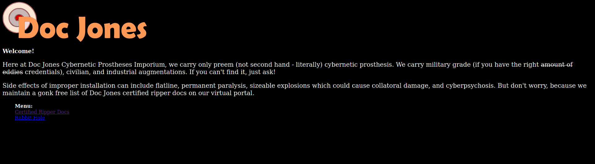
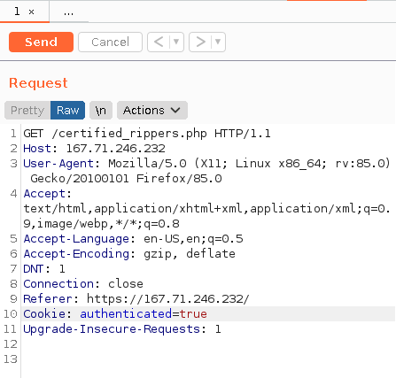

# Solution for Ripper Doc

## Problem worth 50 points under Web App
## Statement:
Find the flag in the ripper doc list.
(We were provided with a link to the site which contains the list.)

## Solution:
I started off by visiting the site and checking page sources, but nothing interesting came up except the flag for a previous challenge :P 



There was a link to the Ripper Doc list on the homepage so I decided to give it a try. Come on it wouldn't be that easy would it? I was denied access to the list, it read ```Sorry, gotta be in the club to get this list.``` 


Well I wasn't a member of whatever club they were talking about so I had to figure out a way to get my membership. I fired up ```burpsuite``` and started to intercept my HTTP requests. I captured the request for the ripper doc list page and it looked something like this:


I could clearly see a cookie set to false which resulted in me being flagged outside the club. The simple solution that came to mind was to set the cookie to true and send the modified request via ```burp repeater```.



Once the request was sent, the response clearly changed and I was authenticated as a member of the club.


I could see the flag in the page source but here is an extra image of how the page looks when rendered


And the flag ```flag{messing_with_cookies}``` is clearly visible. 
